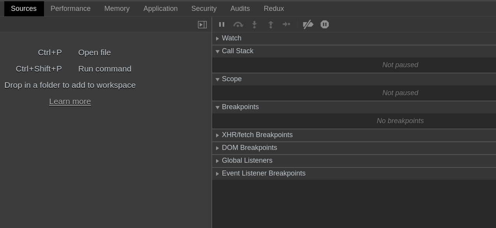
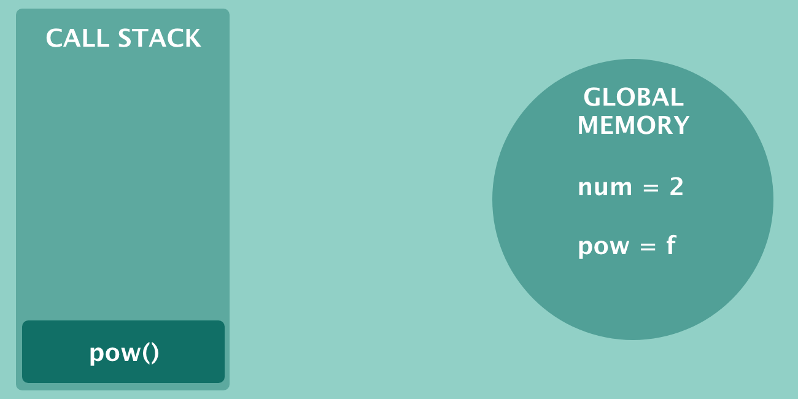
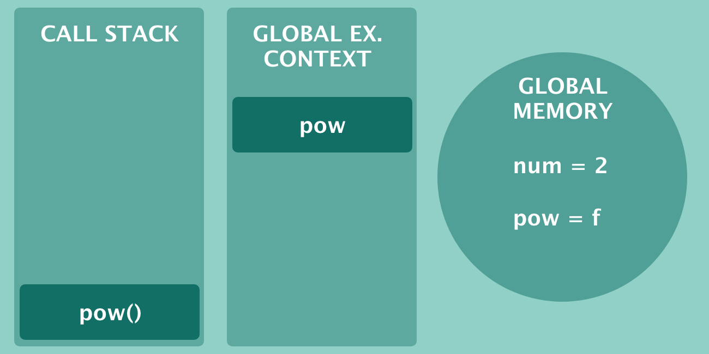
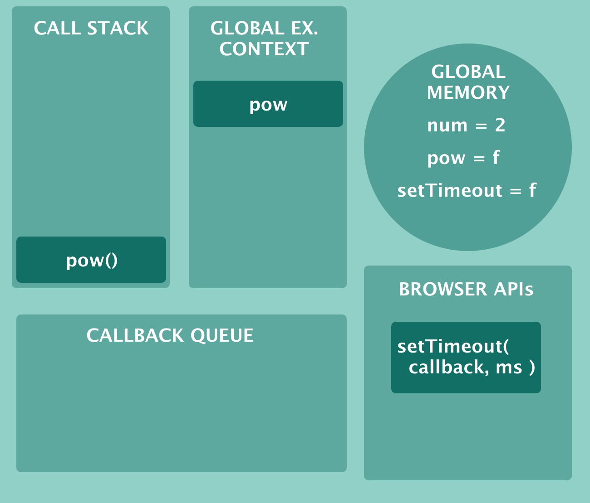
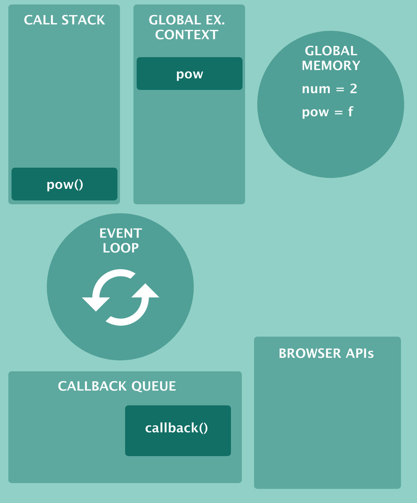

# Chapter 3. A whirlwind tour of JavaScript engines

Let's begin our immersion in the language by introducing the wonderful world of JavaScript engines.

Ever wondered how browsers read and run JavaScript code? It seems magic but you can get an hint of what's happening under the hood. Open up a browser console in Chrome and take a look at the Sources tab. You'll see some boxes, one of the more interesting named Call Stack (in Firefox you can see the Call Stack after inserting a breakpoint into the code):
 

 
What's a Call Stack? Looks like there is a lot of stuff going on, even for running a couple line of code. JavaScript in fact does not come out of the box with every web browser. There is a big component which compiles and interprets our JavaScript code: it's the JavaScript engine. The most popular JavaScript engines are V8, used by Google Chrome and Node.js, SpiderMonkey for Firefox, and JavaScriptCore, used by Safari/WebKit. JavaScript engines today are brilliant pieces of engineering and it would be impossible to cover every single facet of them. But there are some smaller pieces in every engine doing the hard work for us. One of these component is the Call Stack and alongside together with Global Memory and Execution Context make possible to run our code. Ready to meet them?

## JavaScript engines and Global Memory

I said that JavaScript is both a compiled and an interpreted language at the same time. Believe it or not JavaScript engines actually compile your code mere microseconds before executing it. That sounds magic right? The magic is called JIT (Just in time compilation). It's a big topic on its own, another book would not be enough to describe how JIT works. But for now we can just skip the theory behind compilation and focus on the execution phase, which is nonetheless interesting.

To start off consider the following code:

```js
var num = 2;

function pow(num) {
    return num * num;
}
```

If I were to ask you how does the above code is processed in the browser? What will you say? You might say "the browser reads the code" or "the browser executes the code". The reality is more nuanced than that. First, it's not the browser that reads that snippet of code. It's the engine. A JavaScript engine reads the code and as soon as it encounters the first line it puts a couple of references into the Global Memory.

The Global Memory (also called Heap) is an area where the JavaScript engine saves variables and function declarations. Pay attention, the difference might sound trivial but function declarations in JavaScript are not the same as function invocations. A function declaration is just a description of what the function should accept and how it's going to be invoked. A function invocation on the other hand is the actual execution of a previously declared function.

So, back to our example, when the engine reads the above code the Global Memory is populated with two bindings:


At this point nothing is executed but what if we try to run our function like so:

```js
var num = 2;

function pow(num) {
    return num * num;
}

pow(num);
```

What will happen? Now things get interesting. When a function is called the JavaScript engine makes room for two more boxes:

- a Global Execution Context
- a Call Stack

Let's see what they are in the next section.

## Global Execution Context and Call Stack

You learned how the JavaScript engine reads variables and function declarations. They end up in a Global Memory (the Heap). But now we executed a JavaScript function and the engine has to take care of it. How? There is a fundamental component in every JavaScript engine, called Call Stack. The Call Stack is a stack data structure: that means elements can enter from the top but they can't leave if there's some element above them. JavaScript functions are exactly like that. Once executing they can't leave the Call Stack if some other function remains stuck. Pay attention because this concept is helpful for wrapping your head around the sentence "JavaScript is single-threaded". But for now let's get back to our example. When the function is called the engine pushes that function inside the call stack:



I like thinking of the Call Stack as a pile of Pringles. We cannot eat a pringle at the bottom of the pile without first eating all the pringles at the top! Luckily our function is synchronous: it's a simple multiplication and it's calculated quickly. At the very same time the engine allocates also a Global Execution Context, which is the global environment where our JavaScript code runs. Here's how it looks like:



Imagine the Global Execution Context as a sea where JavaScript global functions swim like fishes. How nice! But that's just the half of the story. What if our function has some nested variables or one or more inner functions? Even in a simple variation like the following, the JavaScript engine creates a Local Execution Context:

```js
var num = 2;

function pow(num) {
    var fixed = 89;
    return num * num;
}

pow(num);
```
 
Notice that I added a variable named `fixed` inside the function `pow`. In that case the Local Execution Context will contain a box for holding `fixed`. I am not so good at drawing little tiny boxes inside other tiny boxes! Use your imagination for now. The Local Execution Context will appear near `pow`, inside the greener box contained in the Global Execution Context. You can also imagine that for every nested function of a nested function the engine creates more Local Execution Contexts. These boxes can go to far so quickly! Like a matrioska! Now how about getting back to that single-threaded story? What does it means?

We say that JavaScript is single-threaded because there is a single Call Stack handling our functions. That is, functions can't leave the Call Stack if there are other functions waiting for execution. That's not a problem when dealing with synchronous code. For example, a sum between two numbers is synchronous and runs in microseconds. But how about network calls and other interactions with the outside world? Luckily JavaScript engines are designed to be asynchronous by default. Even if they can execute one function at a time there is a way for slower function to be executed by an external entity: the browser in our case. We'll explore this topic later.

In the meantime you learned that when a browser loads some JavaScript code an engine reads line by line and performs the following steps:

- populates the Global Memory (Heap) with variables and function declarations
- pushes every function invocation into a Call Stack
- creates a Global Execution Context in which global functions are executed
- creates lot of tiny Local Execution Contexts (if there are inner variables or nested functions)

You should have by now a big picture of the synchronous mechanic at the base of every JavaScript engine. In the next sections you'll see how asynchronous code works in JavaScript and why it works that way.

## Asynchronous JavaScript, Callback Queue and the Event Loop

Global Memory, Execution Context and Call Stack explain how synchronous JavaScript code runs in our browser. Yet we're missing something. What happens when there is some asynchronous function to run? By asynchronous function I mean every interaction with the outside world that could take some time to complete. Calling a REST API or invoking a timer are asynchronous because they can take seconds to run. With the elements we have so far in the engine there is no way to handle that kind of functions without blocking the Call Stack, and so the browser.

Remember, the Call Stack can execute one function at a time and even one blocking function can literally freeze the browser. Luckily JavaScript engines are smart and with a bit of help from the browser can sort things out. When we run an asynchronous function like setTimeout the browser takes that function and runs it for us. Consider a timer like the following:

```js
setTimeout(callback, 10000);

function callback(){
    console.log('hello timer!');
}
```

I'm sure you saw `setTimeout` hundred of times yet you might not know that it's not a built-in JavaScript function. That is, when JavaScript was born there were no `setTimeout` built into the language. `setTimeout` in fact is part of the so called Browser APIs, a collection of handy tool that the browser gives us for free. How kind! What does it mean in practice? Since `setTimeout` is a Browser APIs that function is run straight by the browser (it appears for a moment into the Call Stack but is removed instantly). Then after 10 seconds the browsers takes the callback function we passed in and moves it into a Callback Queue.

At this point we have two more boxes inside our JavaScript engine. If you consider the following code:

```js
var num = 2;

function pow(num) {
    return num * num;
}

pow(num);

setTimeout(callback, 10000);

function callback(){
    console.log('hello timer!');
}
```

We can complete our illustration like so:



As you can see `setTimeout` runs inside the browser context. After 10 seconds the timer is triggered and the callback function is ready to run. But first it has to go through the Callback Queue. The Callback Queue is a queue data structure and as its name suggest is an ordered queue of functions. Every asynchronous function must pass through the Callback Queue before is pushed into the Call Stack. But who pushes that function forward? There is another component named Event Loop.

The Event Loop has just one job for now: it should check whether the Call Stack is empty. If there is some function into the Callback Queue and if the Call Stack is free, then it's time to push the callback into the Call Stack. Once done the function is executed. This is the big picture of a JavaScript engine for handling asynchronous and synchronous code:



Imagine that `callback()` is ready to be executed. When `pow()` finishes the Call Stack is empty and the Event Loop pushes `callback()` in. That's it! If you understand the illustration above then your ready to understand all the JavaScript. Remember: Browser APIs, Callback Queue, and Event Loop are the pillars of asynchronous JavaScript. And if you fancy videos I suggest watching [What the heck is the event loop anyway](https://www.youtube.com/watch?v=8aGhZQkoFbQ) by Philip Roberts. It's one of the best explanation ever of the Event Loop. Hold on though because we're not done with asynchronous JavaScript. In the next sections we'll take a closer look at ES6 Promises.

## Callback hell and ES6 Promises

Callback functions are everywhere in JavaScript. They are used both for synchronous and asynchronous code. Consider the `map` method for example:

```js
function mapper(element){
    return element * 2;
}

[1, 2, 3, 4, 5].map(mapper);
```

`mapper` is a callback function passed inside `map`. The above code is synchronous. But consider instead an interval:

```js
function runMeEvery(){
    console.log('Ran!');
}

setInterval(runMeEvery, 5000);
```

That code is asynchronous, yet as you can see we pass the callback `runMeEvery` inside `setInterval`. Callbacks are pervasive in JavaScript so that during the years a problem emerged: callback hell. Callback hell in JavaScript refers to a "style" of programming where callbacks are nested inside callbacks which are nested ... inside other callbacks. Due to the asynchronous nature of JavaScript programmers fell into this trap over the years. To be honest I never run into extreme callback pyramids, maybe because I value readable code and I always try sticking to that principle. If you end up in a callback hell it's a sign that your function is doing too much.

I won't cover callback hell here, if you're curious there is a website, [callbackhell.com](http://callbackhell.com/) which explores the problem in more detail and offers some solutions. What we want to focus on now are ES6 Promises. ES6 Promises are an addition to the JavaScript language aiming to solve the dreaded callback hell. But what is a Promise anyway?

A JavaScript Promise is the representation of an future event. A Promise can end with success: in jargon we say it's resolved (fulfilled). But if the Promise errors out we say it's in a rejected state. Promises have also a default state: every new Promise starts in pending state. It is possible to create your own Promise? Yes. For creating a new Promise you call the Promise constructor by passing a callback function into it. The callback function can take two parameters: resolve and reject. Let's create a new Promise which will resolve in 5 seconds (you can try the examples in a browser's console):

```js
const myPromise = new Promise(function(resolve){
    setTimeout(function(){
        resolve()
    }, 5000)
});
```

As you can see resolve is a function that we call for making the Promise succeed. Reject on the other hand makes a rejected Promise:

```js
const myPromise = new Promise(function(resolve, reject){
    setTimeout(function(){
        reject()
    }, 5000)
});
```

Note that in the first example you can omit reject because it's the second parameter. But if you intend to use reject you can't omit resolve. In other words the following code won't work and will end up in a resolved Promise:

```js
// Can't omit resolve !

const myPromise = new Promise(function(reject){
    setTimeout(function(){
        reject()
    }, 5000)
});
```

Now, Promises don't look so useful isn't it? Those example print nothing to the user. Let's add some data to the mix. Both resolved and rejected Promises can return data. Here's an example:

```js
const myPromise = new Promise(function(resolve) {
  resolve([{ name: "Chris" }]);
});
```

But still we can't see any data. For extracting data from a Promise you need to chain a method called `then`. It takes a callback (the irony!) which receives the actual data:

```js
const myPromise = new Promise(function(resolve, reject) {
  resolve([{ name: "Chris" }]);
});

myPromise.then(function(data) {
    console.log(data);
});
```

As a JavaScript developer and consumer of other's people code you will mostly interact with Promises from the outside. Library creators instead are more likely to wrap legacy code inside a Promise constructor like so:

```js
const shinyNewUtil = new Promise(function(resolve, reject) {
  // do stuff and resolve
  // or reject
});
```

When in need we can also create and resolve a Promise in place by calling Promise.resolve():

```js
Promise.resolve({ msg: 'Resolve!'})
.then(msg => console.log(msg));
```

So to recap a JavaScript Promise is a bookmark for an event happening in the future. The event starts in a pending state and can either succeed (resolved, fulfilled) or fail (rejected). A Promise can return data and that data can be extracted by attaching `then` to the Promise. In the next section we'll see how to deal with errors coming from a Promise.

## ES6 Promises and error handling

Error handling in JavaScript has been always straightforward, at least for synchronous code. Consider the following example:

```js
function makeAnError() {
  throw Error("Sorry mate!");
}

try {
  makeAnError();
} catch (error) {
  console.log("Catching the error! " + error);
}
```

The output will be:

```js
Catching the error! Error: Sorry mate!
```

The error got in the catch block as expected. Now let's try with an asynchronous function:

```js
function makeAnError() {
  throw Error("Sorry mate!");
}

try {
  setTimeout(makeAnError, 5000);
} catch (error) {
  console.log("Catching the error! " + error);
}
```

The above code is asynchronous because of setTimeout. What happens if we run it?

```js
  throw Error("Sorry mate!");
  ^

Error: Sorry mate!
    at Timeout.makeAnError [as _onTimeout] (/home/valentino/Code/piccolo-javascript/async.js:2:9)
```

This time the output is different. The error didn't go through the catch block. It was free to propagate up in the stack. That's because try/catch only works with synchronous code. If you're curious the problem is explained in great detail in [Error Handling in Node.js](https://www.joyent.com/node-js/production/design/errors). Luckily with Promises there is a way to handle asynchronous errors like they were synchronous. If you recall from the previous section a call to reject is what makes a rejected Promise:

```js
const myPromise = new Promise(function(resolve, reject) {
  reject('Errored, sorry!');
});
```

In the above case we can handle the error with the catch handler, taking (again) a callback:

```js
const myPromise = new Promise(function(resolve, reject) {
  reject('Errored, sorry!');
});

myPromise.catch(err => console.log(err));
```

We can also call Promise.reject() for creating and rejecting a Promise in place:

```js
Promise.reject({msg: 'Rejected!'}).catch(err => console.log(err));
```

To recap: the `then` handler runs when a Promise is fulfilled while the catch handler runs for rejected Promises. But that's no the end of the story. Later we will see how async/await works nicely with try/catch.

## ES6 Promises combinators: Promise.all, Promise.allSettled, Promise.any, and friends

Promises are not meant to go alone. The Promise API offers a bunch of methods for combining Promises together. One of the most useful is Promise.all which takes an array of Promises and returns a single Promise. The problem is that Promise.all rejects if any Promise in the array is rejected.

Promise.race resolves or reject as soon as one of the Promise in the array is settled. It still rejects if one of the Promise rejects.

Newer versions of V8 are also going to implement two new combinators: Promise.allSettled and Promise.any. Promise.any is still in the early stages of the proposal: at the time of this writing there is still no support for it. But the theory is that Promise.any can signal whether any of the Promise is fullfilled. The difference from Promise.race is that Promise.any does not rejects even if one of the Promise is rejected.

Anyway the most interesting of the two is Promise.allSettled. It still takes an array of Promises but it does not short-circuit if one of the Promise rejects. It is useful for when you want to check if an array of Promises is all settled, regardless of an eventual rejection. Think of it as a countepart of Promise.all.

## ES6 Promises and Microtask Queue

If you remember from the previous sections every asynchronous callback functions ends up in the Callback Queue before being pushed into the Call Stack. But now try to execute the following code:

```javascript
console.log("Start");

setTimeout(() => {
  console.log("Log me!");
}, 0);

const myPromise = new Promise(function(resolve, reject) {
  resolve([{ name: "Chris" }]);
});

myPromise.then(data => console.log(data));

console.log("End");
```

What the output could be? Our Promise has no delay so it should return alongside with `Log me!`. But we'll get:

```js
Start
End
[ { name: 'Chris' } ]
Log me!
```

That's because callbacks function passed in a Promise have a different fate: they are handled by the Microtask Queue. And there's an interesting quirk you should be aware of: Microtask Queue has precedence over the Callback Queue. When the Event Loop checks if there is any new callback ready to be pushed into the Call Stack callbacks from the Microtask Queue have priority. The Microtask Queue is an addition to ECMAScript 2015.

## Asynchronous evolution: from Promises to async/await

JavaScript is moving fast and every year we get constant improvements to the language. Promises seemed the arrival point but with ECMAScript 2017 (ES8) a new syntax was born: `async/await`. async/await is just a stylistic improvement, what we call syntactic sugar. async/await does not alter JavaScript by any means (remember, JavaScript must be backward compatible with older browser and should not break existing code). It is just a new way for writing asynchronous code based on Promises. Let's make an example. Earlier we save a Promise with the corresponding `then`:

```js
const myPromise = new Promise(function(resolve, reject) {
  resolve([{ name: "Chris" }]);
});

myPromise.then((data) => console.log(data))
```

Now with async/await we can handle asynchronous code in a way that looks synchronous from the reader's point of view. Instead of using `then` we can wrap the Promise inside a function marked `async` and then `await` on the result:

```js
const myPromise = new Promise(function(resolve, reject) {
  resolve([{ name: "Chris" }]);
});

async function getData() {
  const data = await myPromise;
  console.log(data);
}

getData();
```

Makes sense right? Now, the funny thing is that an async function will always return a Promise and nobody prevents you from doing that:

```js
async function getData() {
  const data = await myPromise;
  return data;
}

getData().then(data => console.log(data));
```

And how about errors? One of the boon offered by async/await is the chance to use `try/catch`. Let's look again at a Promise where for handling errors we use the `catch` handler:

```js
const myPromise = new Promise(function(resolve, reject) {
  reject('Errored, sorry!');
});

myPromise.catch(err => console.log(err));
```

With async functions we can refactor to the following code:

```js
async function getData() {
  try {
    const data = await myPromise;
    console.log(data);
    // or return the data with return data
  } catch (error) {
    console.log(error);
  }
}

getData();
```

Not everybody is still sold to this style though. `try/catch` can make your code noisy. And while using `try/catch` there is another quirk to point out. Consider the following code, raising an error inside a `try` block:

```js
async function getData() {
  try {
    if (true) {
      throw Error("Catch me if you can");
    }
  } catch (err) {
    console.log(err.message);
  }
}

getData()
  .then(() => console.log("I will run no matter what!"))
  .catch(() => console.log("Catching err"));
```

What of the two strings is printed to the console? Remember that `try/catch` is a synchronous construct but our asynchronous function produces a Promise. They travel on two different tracks, like two trains. But they will never meet! That is, an error raised by `throw` will never trigger the `catch` handler of `getData()`. Running the above code will result in "Catch me if you can" followed by "I will run no matter what!". In the real world we don't want `throw` to trigger a `then` handler. One possible solution is returning `Promise.reject()` from the function:

```js
async function getData() {
  try {
    if (true) {
      return Promise.reject("Catch me if you can");
    }
  } catch (err) {
    console.log(err.message);
  }
}
```

Now the error will be handled as expected:

```js
getData()
  .then(() => console.log("I will NOT run no matter what!"))
  .catch(() => console.log("Catching err"));

"Catching err" // output
```

Besides that async/await seems the best way for structuring asynchronous code in JavaScript. We have better control over error handling and the code looks more cleaner. Anyway, I don't advise refactoring all your JavaScript code to async/await. These are choices that must be discussed with the team. But if you work alone whether you use plain Promises or async/await it's a matter of personal preference.

## Conclusions

JavaScript is a scripting language for the web and has the peculiarity of being compiled first and then interpreted by an engine. Among the most popular JavaScript engines there are V8, used by Google Chrome and Node.js, SpiderMonkey, built for the web browser Firefox, and JavaScriptCore, used by Safari.

JavaScript engines have a lot of moving parts: Call Stack, Global Memory, Event Loop, Callback Queue. All these parts work together in perfect tuning for handling synchronous and asynchronous code in JavaScript. JavaScript engines are single-threaded, that means there is a single Call Stack for running functions. This restriction is at the base of JavaScript's asynchronous nature: all the operations that require time must be taken in charge by an external entity (the browser for example) or by a callback function.

Since ES6, JavaScript engines also implement a Microtask Queue. The Microtask Queue is a queue data structure much like the Callback Queue. Only difference is that the Microtask Queue takes all the callbacks triggered by ES6 Promises. These callbacks, also called executors, have precedence over callbacks handled by the Callback Queue. The mechanic is exposed in greater detail by Jake Archibald in [Tasks, microtasks, queues and schedules](https://jakearchibald.com/2015/tasks-microtasks-queues-and-schedules/).

For simplifying asynchronous code flow ECMAScript 2015 brought us Promises. A Promise is an asynchronous object and is used to represent either the failure or the success of any asynchronous operation. But the improvements did not stop there. In 2017 `async/await` was born: it's a stylistic make up for Promises that makes possible to write asynchronous code as if it was synchronous. And more important makes possible to use `try/catch` for handling errors in asynchronous code.