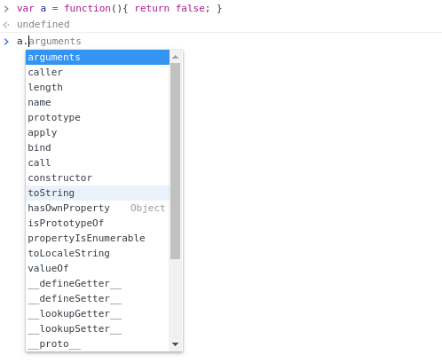

# Chapter 5. The secret life of JavaScript objects

## Everything is an object!

How many times have you heard "everything is an object in JavaScript"? Have you ever asked yourself what's the true meaning of that? "Everything is an object" is common to other languages too, like Python. But objects in Python are not just containers for values like a JavaScript object. Object in Python is a class. There is something similar in JavaScript but an "object" in JS is just a container for keys and values:

```js
var obj = { name: "Tom", age: 34 }
```

Really, an object in JavaScript is a "dumb" type yet a lot of other entities seem to derive from objects. Even arrays. Create an array in JavaScript like so:

```js
var arr = [1,2,3,4,5]
```

and then check it out with the `typeof` operator. You'll see a surprising result:

```js
typeof arr
"object"
```

It appears that arrays are a special kind of object! Even functions in JavaScript are objects. And there's more if you dig deeper. Create a function and you will have methods ready for use, attached to that function:

```js
var a = function(){ return false; }
a.toString()
```

Output:

```js
"function(){ return false; }"
```

There must be something more under the hood because I didn't attach `toString` to my function. Did you? Where does it come from? Turns out `Object` has a method named `.toString`. Seems like our function has the same methods of `Object`!

```js
Object.toString()
```

The mystery thickens even more if we look at all the methods and properties "attached" to a simple JavaScript function:



Who put those methods there? I said that functions in JavaScript are a special kind of object. Could it be an hint? Maybe! But for now let's hold our joy. Take a look again at the picture above: there is a strangely named property on our function called prototype. What's that?

prototype in JavaScript is an object. It is like a backpack, attached to most of the JavaScript built-in objects. For example Object, Function, Array, Date, Error, all have a "prototype":

```js
typeof Object.prototype // 'object'
typeof Date.prototype // 'object'
typeof String.prototype // 'object'
typeof Number.prototype // 'object'
typeof Array.prototype // 'object'
typeof Error.prototype // 'object'
```

Pay attention that built-in objects have a capital letter and resemble those lego bricks we saw earlier:

- String
- Number
- Boolean
- Object
- Symbol
- Null
- Undefined

These lego bricks are JavaScript's types, and most of them are also primitives, except Object which is a type. Built-in objects on the other hand are like mirrors of JavaScript's types and are used as a function too. For example you can use `String` as a function for converting a number to a string:

```js
String(34)
```

But for now let's stick to "prototype". Prototype is an home for all the common method and properties that should be available across "child" objects deriving from an ancestor. That is, given an original prototype, JavaScript developers can create new objects that will use a single prototype as the source of truth for common functions. Let's see how (spoiler: Object.create).

Suppose you're absolutely new to the language but your boss gives you a task with JavaScript. You should build a chat application and she said that Person is one of the "models" of this app. A person can connect to a channel, can send messages and maybe is welcomed with a nice greeting when she logs in. Being new to JavaScript you don't even know where to start. But you're smart and from the documentation you've been reading lately it appears that JavaScript objects are really powerful. In particular [this page on MDN](https://developer.mozilla.org/en-US/docs/Web/JavaScript/Reference/Global_Objects/Object) lists all the methods available on JavaScript objects and `create()` looks interesting. `Object.create()` "creates a new object with the specified prototype object and properties".

Maybe there is a way to create a "primitive" Person from which other objects can copy methods and properties? We saw from chapter 2 that objects in JavaScript may contain not only simple values but also functions:

```js
var firstObj = {
  name: "Alex",
  age: 33,
  hello: function() {
    console.log("Hello " + this.name);
  }
};
```

Now that's a game changer! Let's create a Person object then. While we're there let's use ES6 template literals for concatenating "Hello" with the name:

```js
var Person = {
  name: "noname",
  age: 0,
  greet: function() {
    console.log(`Hello ${this.name}`);
  }
};
```

You may wonder why I'm using a capital letter for Person. We'll see later in detail but for now think of it as of a convention developers use for signalling "models". Person is a model in your application. Given this Person blueprint we need to create more people starting from that single Person. And `Object.create()` is your friend here.

## Creating and linking objects

You have a feeling that objects in JavaScript are somehow linked together. And `Object.create()` confirms the theory. This method creates new objects starting from an original object. Let's create a new person then:

```js
var Person = {
  name: "noname",
  age: 0,
  greet: function() {
    console.log(`Hello ${this.name}`);
  }
};

var Tom = Object.create(Person);
```

Now, Tom is a new person but I didnt't specify any new method or property on it. Yet it still has access to the original name and age:

```js
var Person = {
  name: "noname",
  age: 0,
  greet: function() {
    console.log(`Hello ${this.name}`);
  }
};

var Tom = Object.create(Person);

var tomAge = Tom.age;
var tomName = Tom.name;

console.log(`${tomAge} ${tomName}`);

// Output: 0 noname
```

Bingo! Now you can create new people starting from a single, common ancestor. But the weird thing is that new objects remains connected to the original object. Not a big problem since "children" objects can customize properties and methods:

```js
var Person = {
  name: "noname",
  age: 0,
  greet: function() {
    console.log(`Hello ${this.name}`);
  }
};

var Tom = Object.create(Person);

Tom.age = 34;
Tom.name = "Tom";
var tomAge = Tom.age;
var tomName = Tom.name;

console.log(`${tomAge} ${tomName}`);

// Output: 34 Tom
```

And that's called "shadowing" the original properties. There is also another way for passing properties to our new object. `Object.create` takes another object as the second argument where you can specify keys and values for the new object:

```js
var Tom = Object.create(Person, {
  age: {
    value: 34
  },
  name: {
    value: "Tom"
  }
});
```

Properties configured this way are by default not writable, not enumerable, not configurable. Not writable means you cannot change that property later, the alteration is simply ignored:

```js
var Tom = Object.create(Person, {
  age: {
    value: 34
  },
  name: {
    value: "Tom"
  }
});

Tom.age = 80;
Tom.name = "evilchange";

var tomAge = Tom.age;
var tomName = Tom.name;

Tom.greet();

console.log(`${tomAge} ${tomName}`);

// Hello Tom
// 34 Tom
```

Not enumerable means that properties will not show in a for...in loop for for example:

```js
for (const key in Tom) {
  console.log(key);
}

// Output: greet
```

But as you can see, linked properties shows up because the JavaScript engine goes up the link chain and finds greet up on the "parent" object. Finally not configurable means the property neither can be modified, nor deleted:

```js
Tom.age = 80;
Tom.name = "evilchange";
delete Tom.name;
var tomAge = Tom.age;
var tomName = Tom.name;

console.log(`${tomAge} ${tomName}`);

// 34 Tom
```

If you want to change the behaviour of properties just specify whether you want them writable, configurable and maybe enumerable:

```js
var Tom = Object.create(Person, {
  age: {
    value: 34,
    enumerable: true,
    writable: true,
    configurable: true
  },
  name: {
    value: "Tom",
    enumerable: true,
    writable: true,
    configurable: true
  }
});
```

Now, back to our person, Tom has also access to greet() by the way:

```js
var Person = {
  name: "noname",
  age: 0,
  greet: function() {
    console.log(`Hello ${this.name}`);
  }
};

var Tom = Object.create(Person);

Tom.age = 34;
Tom.name = "Tom";
var tomAge = Tom.age;
var tomName = Tom.name;
Tom.greet();

console.log(`${tomAge} ${tomName}`);

// Hello Tom
// 34 Tom
```

Don't worry too much about "this" for now. In the next chapter you'll learn more about it. For now keep in mind that "this" is a reference to some object in which the function is executing. In our case greet() runs in the context of Tom and for that reason has access to "this.name".

And now that you know a bit more about JavaScript objects let's explore another pattern for creating entities: the constructor function.

## Constructing JavaScript objects

Up until now I gave you just an hint of the "prototype" but other than playing with `Object.create()` we didnt' use it directly. A lot of developers coming from more traditional languages like Java stumbled upon `Object.create()` and "prototypal" over the years. They had to find a way for making sense of this weird JavaScript language. So with the time a new pattern emerged: the constructor function. Using a function for creating new objects sounded reasonable. Suppose you want to transform your Person object to a function, you could come up with the following code:

```js
function Person(name, age) {
  var newPerson = {};
  newPerson.age = age;
  newPerson.name = name;
  newPerson.greet = function() {
    console.log("Hello " + newPerson.name);
  };
  return newPerson;
}
```

So instead of calling `Object.create()` all over the place you can simply call Person as a function and get back an object:

```js
var me = Person("Valentino");
```

The constructor pattern helps encapsulating the creation and the configuration of a series of JavaScript objects. And here again we have Person with the capital letter. It's a convention borrowed from object oriented languages where classes have a capital letter. In JavaScript there are no classes but this style eventually made developers more comfortable. Now the example above has a serious problem: every time we create a new object we duplicate greet() over and over. That's sub-optimal. Luckily you learned that `Object.create()` creates links between objects and that leads to a nicer solution. First things first let's move the greet() method outside, to an object on its own. You can then link new objects to that common object with `Object.create()`:

```js
var personMethods = {
  greet: function() {
    console.log("Hello " + this.name);
  }
};

function Person(name, age) {
  // greet lives outside now
  var newPerson = Object.create(personMethods);
  newPerson.age = age;
  newPerson.name = name;
  return newPerson;
}

var me = Person("Valentino");
me.greet();

// Output: "Valentino"
```

How nice! But still we can do better. How about the good 'ol "prototype" you saw earlier? Could help here? Turns out, functions (and all the built-in objects) in JavaScript have a backpack called prototype. prototype is just another object and can contain everything we can think of: properties, methods. For adding a method to our Person prototype you can do:

```js
Person.prototype.greet = function() {
  console.log("Hello " + this.name);
};
```

and get rid of `personMethods`. The only problem now is that new objects won't be linked automagically to a common ancestor unless we adjust the argument for `Object.create`:

```js
function Person(name, age) {
  // greet lives outside now
  var newPerson = Object.create(Person.prototype);
  newPerson.age = age;
  newPerson.name = name;
  return newPerson;
}

Person.prototype.greet = function() {
  console.log("Hello " + this.name);
};

var me = Person("Valentino");
me.greet();

// Output: "Valentino"
``` 

Now the source for all common methods is `Person.prototype`. At this point we're ready to do the last tweak to our Person because there is a more cleaner way for arranging that function. With the [new operator in JavaScript](https://developer.mozilla.org/en-US/docs/Web/JavaScript/Reference/Operators/new) we can get rid of all the noise inside Person and just take care of assigning the arguments to `this`. That means, the following code:

```js
function Person(name, age) {
  // greet lives outside now
  var newPerson = Object.create(Person.prototype);
  newPerson.age = age;
  newPerson.name = name;
  return newPerson;
}
```

becomes:

```js
function Person(name, age) {
  this.name = name;
  this.age = age;
}
```

And here's the complete code:

```js
function Person(name, age) {
  this.name = name;
  this.age = age;
}

Person.prototype.greet = function() {
  console.log("Hello " + this.name);
};

var me = new Person("Valentino");
me.greet();

// Output: "Valentino"
```

Note that now you need to prefix the function call with `new`. That's called "constructor call" and it's the "standard" syntax for creating new shape of objects in JavaScript. In other words, new does all the hard work for us:

- creates a new blank objects
- links the object to a prototype
- points this to the newly created object
- returns the new object

Neat!

## Checking the "linkage"

There are many ways for checking the link between our JavaScript objects. `Object.getPrototypeOf` for example is a method which returns the prototype of any given object. Consider the following code where Tom is created from a "Person" blueprint:

```js
var Person = {
  name: "noname",
  age: 0,
  greet: function() {
    console.log(`Hello ${this.name}`);
  }
};

var Tom = Object.create(Person);
```

You can check if Person appears to be the prototype of Tom:

```js
var tomPrototype = Object.getPrototypeOf(Tom);

console.log(tomPrototype === Person);

// Output: true
```

`Object.getPrototypeOf` works of course also if you constructed the object with a constructor call. But you should check against the prototype object, not on the constructor function itself:

```js
function Person(name, age) {
  this.name = name;
  this.age = age;
}

Person.prototype.greet = function() {
  console.log("Hello " + this.name);
};

var me = new Person("Valentino");

var mePrototype = Object.getPrototypeOf(me);

console.log(mePrototype === Person.prototype);

// Output: true
```

Besides `Object.getPrototypeOf` there is another method, `isPrototypeOf`. It checks whether the given prototype appears in the prototype chain of the object we're checking against. In the example above "me" is an object linked to Person.prototype. So the following check returns "Yes I am!":

```js
Person.prototype.isPrototypeOf(me) && console.log("Yes I am!");
```

There is also a third way for checking the link between JavaScript objects: it's the `instanceof` operator. In all honesty the name is a bit misleading because there are no "instances" in JavaScript. In a true object oriented language an instance is a new object created from a class. Consider the following example in Python. We have a class named Person and from that class we create a new instance called "tom":

```python
class Person():
    def __init__(self, age, name):
        self.age = age;
        self.name = name;

    def __str__(self):
        return f'{self.name}'
        

tom = Person(34, 'Tom')
```

Notice that in Python there is no `new` keyword. Now we can check whether tom is an instance of Person with the `isinstance` method:

```python
isinstance(tom, Person)

// Output: True
```

Tom is also an instance of "object" in Python and the following code returns true as well:

```python
isinstance(tom, object)

// Output: True
```

According to the documentation `isinstance` "Return true if the object argument is an instance of the class argument, or of a (direct, indirect or virtual) subclass thereof". So we're talking about classes here. Now let's see what `instanceof` does instead. We're going to create tom starting from a Person function in JavaScript (because there are no real classes):

```javascript
function Person(name, age) {
  this.name = name;
  this.age = age;
}

Person.prototype.greet = function() {
  console.log(`Hello ${this.name}`);
};

var tom = new Person(34, "Tom");
```
 
And now let's use `instanceof` in a creative way:

```js
if (tom instanceof Object) {
  console.log("Yes I am!");
}

if (tom instanceof Person) {
  console.log("Yes I am!");
}
```

Take a moment and try to guess the output. `instanceof` simply checks whether `Person.prototype` or `Object.prototype` appear in the prototype chain of tom. And indeed they are! The output is "Yes I am!" "Yes I am!".

So here's the key takeaway: the prototype of a JavaScript object is (almost) always connected to both the direct "parent" and to `Object.prototype`. There are no classes like Python or Java. JavaScript is just made out of objects. But since I mentioned it, what's a prototype chain by the way? If you paid attention I mentioned "prototype chain" a couple of times. It may look like magic that a JavaScript object has access to a method defined elsewhere in the code. Consider again the following example:

```js
var Person = {
  name: "noname",
  age: 0,
  greet: function() {
    console.log(`Hello ${this.name}`);
  }
};

var Tom = Object.create(Person);

Tom.greet();
```

Tom has access to `greet()` even though the method does not exists directly on the "Tom" object. How is that possible? Unlike OOP languages like Python or Java where every child object gets a copy of all the parent's methods, in JavaScript the relation works kind of backward. Children remain connected to the parent and have access to properties and methods from it. That's an intrinsic trait of JavaScript which borrowed the prototype system from another language called Self. When I access `greet()` the JavaScript engine checks if that method is available directly on Tom. If not the search continues up the chain until the method is found. The "chain" is the hierarchy of prototypes objects to which Tom is connected. In our case Tom is an objects of type Person so Tom's prototype is connected to Person.prototype. And Person.prototype is an object of type Object so shares the same prototype of Object.prototype. If `greet()` would not have been available on Person.prototype then the search would have continued up the chain until reaching Object.prototype. That's what we call a "prototype chain".

You might have read the term "prototypal inheritance" in dozens of tutorials. I see a lot of JavaScript developers confused by "prototypal inheritance". It's simpler than you think: there is no "prototypal inheritance" in JavaScript. Just forget that sentence and remember that JavaScript objects are most of the times linked to other objects. It's a link. There is no inheritance.

And now having shed some light on JavaScript objects, let's talk a bit about ES6 classes. What are they, really?

## Class illusion

There is a huge literature on ES6 classes so here I'll give you just a taste of what they are. Is JavaScript a real object oriented language? It seems so if you look at this code:

```js
class Person {
  constructor(name) {
    this.name = name;
  }

  greet() {
    console.log(`Hello ${this.name}`);
  }
}
```

The syntax is quite similar to classes in other programming languages like Python:

```python
class Person:
    def __init__(self, name):
        self.name = name
    
    def greet(self):
        return 'Hello' + self.name
```

or PHP (forgive me father):

```php
class Person {
    public $name; 

    public function __construct($name){
        $this->name = $name;
    }

    public function greet(){
        echo 'Hello ' . $this->name;
    }
}
```

Classes have been introduced with ES6 in 2015. But at this point it should be clear to you that there are no "real" classes in JavaScript. Everything is just an object and despite the keyword `class` the "prototype system" is still there. Remember, new JavaScript versions are backward-compatible. That means new feature are added on top of existing ones an most of those new feature are syntactic sugar over legacy code. So what's a class? There is a tool called Babel which helps developer to write modern JavaScript code and then run that code even in older browsers. In other words new syntax like ES6 class is transformed to a legacy version. In fact if you copy the Person class in the [Try it out section of the Babel website](https://babeljs.io/repl) you'll get a Person function and a bunch of other methods. What a surprise! In the end everything narrows down to prototypes, objects, and functions!

## Conclusions

Almost everything in JavaScript is an object. Literally. JavaScript objects are containers for keys and values and may also contain functions. Object is the basic building block in JavaScript: so that it's possible to create other custom objects starting from a common ancestor. Then we can link objects together by the means of an intrinsic trait of the language: the prototype system. Starting from a common object we can create other objects sharing the same properties and methods of the original "parent". But the way this works is not by copying methods and properties to every child, like OOP languages do. In JavaScript every derived object remains connected to the parent. New custom objects are created either with `Object.create` or with a so called constructor function. Paired with the `new` keyword, constructor functions sort of mimic traditional OOP classes.