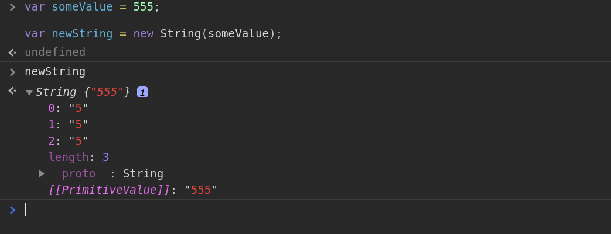

# Chapter 7. Types, conversion, and comparison in JavaScript

## Primitive types in JavaScript

At the beginning of the book we saw some of the JavaScript's fundamental units like strings and numbers:

```js
var greet = "Hello";
var year = 89;
```

Strings and numbers are part of the so called "types" of the language, also known as "primitives" (except Object which is a type on its own). The complete list is:

- String
- Number
- Boolean
- Null
- Undefined
- Object
- Symbol (added in ES6)

Booleans represent values that could be either `true` or `false`. `null` on the other hand is the intentional absence of a value. `null` is usually assigned to a variable for signalling that the variabile will be later populated with something meaningful.

```js
var maybe = null;
```

And then there is `undefined` which means that a variable has still nothing attached to it:

```js
var name;
console.log(name)
undefined
```

`null` and `undefined` look pretty similar yet they are two distinct entities so much that developers are still unsure which one to use.
 
If you want to find out the type of a JavaScript entity you can use the `typeof` operator. Let's try with a string:

```js
typeof "alex"
"string"
```

with a number:

```js
typeof 9
"number"
```

with a boolean:

```js
typeof false
"boolean"
```

on `undefined`:

```js
typeof undefined
"undefined"
```

and with `null`:

```js
typeof null
"object"
```

which gives us a suprising result! `null` looks like an `object` but in reality it is an historic bug in JavaScript, lying there since the language was born. JavaScript has always had a bad reputation because of these things. And that's just the beginning. There are some strange rules for converting between one type and another. Let me give you a bit of context. Let's make an example in Python. The following instruction in Python:

```python
'hello' + 89
```

gives you a clear error:

```python
TypeError: can only concatenate str (not "int") to str
```

While in JavaScript only the sky is your limit:

```js
'hello' + 89
```

in fact gives:

```js
"hello89"
```

Things looks even more stranger if we try adding an array to a string:

```js
'hello' + []
```

gives:

```js
'hello'
```

and:

```js
'hello' + [89]
```

gives a surprising:

```js
"hello89"
```

Looks like there is some kind of logic behind this conversion. It works even with more crowded arrays:

```js
'hello' + [89, 150.156, 'mike']
```

gives:

```js
"hello89,150.156,mike"
```

These two lines of JavaScript are enough to make a Java developer run away. But this behaviour in JavaScript is 100% intentional. So it is worth exploring the most glaring cases of implicit conversion in JavaScript, also know as type coercion.

## When a number becomes a string

Some programming languages have a concept called type casting which means more or less: if I want to convert an entity to another type then I have to make the conversion clear-cut. It is possible in JavaScript too. Consider the following example:

```js
var greet = "Hello";
var year = 89;
```

If I want to convert explicitly I can signal the intention in my code, either with `toString()`:

```js
var greet = "Hello";
var year = 89;

var yearString = year.toString()
```

or with `String`:

```js
var greet = "Hello";
var year = 89;

var yearString = String(year)
```

`String` is part of the so called built-in JavaScript objects which mirror some of the primitive types: `String`, `Number`, `Boolean`, and `Object`. These built-ins can be used for converting between types. After the conversion I can concatenate the two variables:

```js
greet + yearString;
```

But apart from this explicit conversion, in JavaScript there is a subtle mechanic called implicit conversion, kindly offered by JavaScript engines. The language does not prevent us from adding numbers and strings:

```js
'hello' + 89
```

gives:

```js
"hello89"
```

But what's the logic behind this conversion? You may be surprised to find out that the addition operator `+` in JavaScript automagically converts any of the two operands to a string if at least one of them is... a string!

And you may find even more surprising that this rule is set in stone in the ECMAScript spec. [Section 11.6.1](http://www.ecma-international.org/ecma-262/5.1/#sec-11.6.1) defines the behavior of the addition operator which I'll summarize here for you own sake:

> **The addition operator (+)**
>
> If x is String or y is String then return ToString(x) followed by ToString(y)

Does this trick work only on numbers? Not really. Array and objects are subject to the same fate:

```js
'hello' + [89, 150.156, 'mike']
```

gives:

```js
"hello89,150.156,mike"
```

And how about:

```js
'hello' + { name: "Jacopo" }
```

To find the solution you can do a quick test by converting the object to a string:

```js
String({ name: "Jacopo" })
```

which gives:

```js
"[object Object]"
```

So I've a feeling that:

```js
'hello' + { name: "Jacopo" }
```

will give:

```js
"hello[object Object]"
```

But another question remains: what happens with multiplication, division and subtraction?

## I'm not a number!

We saw how the addition operator tries to convert the operands to a string when at least one of them is a string. But what happens with the other arithmetic operators? In JavaScript we have:

| Operator | Operation
|---|:---:|
| `+`  | sum |
| `++`  | increment |
| `*`  | multiplication |
| `**` | exponent (added in ES6) |
| `-`  | subtraction |
| `--`  | decrement |
| `/`  | division |
| `%`  | module (returns the remainder of a division) |

If we use one of these operators (except `+`) against a type that it's not a number then we get a special kind of JavaScript object called `NaN`:

```js
89 ** "alex"
```

in fact gives:

```js
NaN
```

`NaN` stands for not a number and represents any failed arithmetic operation, like in the following code:

```js
var obj = { name: "Jacopo" } % 508897
```

which gives:

```js
console.log(obj)
NaN
```

Pay attention to `typeof` in combination with `NaN`. This code looks ok:

```js
typeof 9 / "alex"
NaN
```

And how about the following?

```js
var strange = 9 / "alex"
```

```js
typeof strange
"number"
```

`NaN` becomes `number` when it is assigned to a variable. This opens up a new question. How can I check whether some variabile is `NaN` or not? There is a new method in ES6 called `isNaN()`:

```js
var strange = 9 / "alex"
```

```js
isNaN(strange)
true
```

But now let's point our attention to JavaScript comparison operators which are as weird as their arithmetic counterparts.

## Equal equal or not?

There are two main families of comparison operators in JavaScript. First we have what I like to call "weak comparison". It's the abstract comparison operator (double equal): `==`. Then there's a "strong comparison" which you can recognize from the triple equal: `===` also called strict comparison operator. Both of them behave in a different way from the other. Let's see some examples. First thing first if we compare two strings with both operators we get consistent results:

```js
"hello" == "hello"
true

"hello" === "hello"
true
```

Everything looks fine. Now let's try to compare two different types, a number and a string. First with the "strong comparison":

```js
"1" === 1
false
```

Makes sense! The string `"1"` is different from the number 1. But what happens with a "weak comparison"?

```js
"1" == 1
true
```

True! JavaScript is saying that the two values are equal. Now it doesn't make any sense. Unless this behaviour has something to do with the implicit conversion we saw earlier. What if the same rules apply? Bingo. The ECMAScript [spec](http://www.ecma-international.org/ecma-262/5.1/#sec-11.9.3) strikes again. Turns out the abstract comparison operator makes an automatic conversion between types, before comparing them. This is an abstract:

> **Abstract Equality Comparison Algorithm**
>
> The comparison x == y is performed as follows:
> if x is String and y is Number return the result of the comparison ToNumber(x) == y

The spec says: if the first operand is a string and the second operand is a number then convert the first operand to a number. Interesting. The JavaScript spec is full of this crazy rules and I highly encourage digging deeper into it. In the meantime unless you have a strong reason to do otherwise avoid the abstract comparison operator in your JavaScript code. You will thank yourself later. And how about the "strong comparison"? The spec at [Strict Equality Comparison](http://www.ecma-international.org/ecma-262/5.1/#sec-11.9.6) says that no automatic conversion is made before comparing values with the triple equal `===`. And using the Strict Equality Comparison in your code will save yourself from silly bugs.

## Primitives and objects

We already saw JavaScript's building blocks: `String`, `Number`, `Boolean`, `Null`, `Undefined`, `Object` and `Symbol`. They are all capitalized and this style appears even in the [ECMAScript spec](http://www.ecma-international.org/ecma-262/5.1/#sec-8). But besides these primitives there are a some twins mirroring the primitives: the so called **built-in objects**. The `String` primitive for example has an equivalent `String` which is used in two ways. If called like a function (by passing an argument) it converts any value into a string:

```js
var someValue = 555;

String(someValue);

"555"
```

If we instead use `String` as a constructor with `new` the result is an object of type string:

```js
var someValue = 555;

var newString = new String(someValue);
```

It is worth inspecting the object in the console for seeing how different from a "plain" string is:



You can use `typeof` for confirming that it is indeed an object:

```js
typeof newString
"object"
```

Other "mirrors" of the primitive types are `Number` which can convert (almost) any value to a number:

```js
var someValue = "555";

Number(someValue);

555;
```

I said almost because you get `NaN` when trying to convert an invalid "number":

```js
var notValidNumber = "aa555";

Number(notValidNumber);

NaN;
```

When used in the constructor form `Number` returns a new object of type number:

```js
var someValue = "555";

new Number(someValue);

Number {555}
```

The `Boolean` built-in behaves the same and can convert any value to a boolean when used as a function

```js
var convertMe = 'alex';

Boolean(convertMe)

true
```

While the constructor returns an object (what a surprise!):

```js
var convertMe = 'alex';

typeof new Boolean(convertMe)

"object"
```

`Object` makes no exceptions:

```js
Object('hello'); // String {"hello"}

Object(1); // Number{1}
```

If called without arguments it returns an empty object:

```js
Object()

{}
```

While if called as a constructor it returns a new object:

```js
new Object({
  name: "Alex",
  age: 33
});

{name: "Alex", age: 33}
```

At this point you might ask yourself: when it is fine to use the built-in objects and when should I initialize values with a primitive?. As a rule of thumb avoid the constructor call when all you need is a simple primitive:

```js
// AVOID THIS
var bool = new Boolean("alex");
var str = new String('hi');
var num = new Number(33);
var strObj = new Object('hello')
```

Beside being impractical this form imposes a performance penalty because we create a new object every single time. Last but not least it doesn't make sense to create an object when we want a simple string or a number. So the following form is preferred:

```js
// OK
var bool = true
var str = 'hi';
var num = 33;
var obj = {
            name: "Alex",
            age: 33
          };
```

You can use `Boolean`, `String`, and `Number` like a function every time there's the need to convert something:

```js
// OK FOR CONVERTING
var boolFromString = Boolean("alex");
var numFromString = Number('22');
```

## Conclusions

There are seven building blocks in JavaScript, namely String, Number, Boolean, Null, Undefined, Object, and Symbol. These types are called primitives. JavaScript developers can manipulate these types with arithmetic and comparison operators. But we need to pay particular attention to both the addition operator `+` and the abstract comparison operator `==` which by nature tend to convert between types. This implicit conversion in JavaScript is called type coercion and is defined in the ECMAScript spec. Whenever possible in your code use always the strict comparison operator `===` instead of `==`. As a best practice always make clear when you intend to convert between one type and another. For this purpose JavaScript has a bunch of built-in objects which mirror the primitive types: `String`, `Number`, `Boolean`. These built-in can be used for converting explicitly between different types.