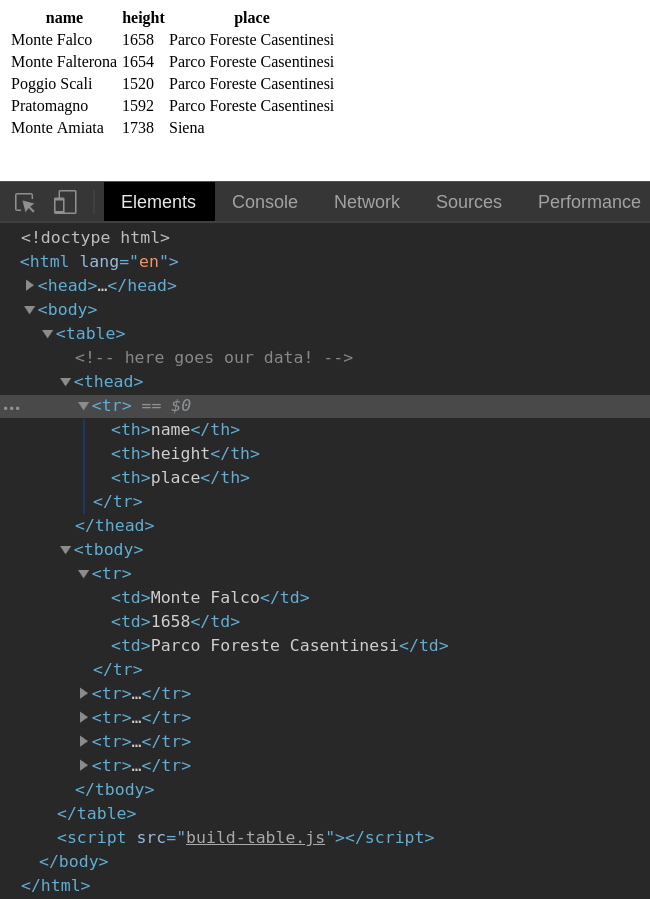

# Chapter 8. Manipulating HTML elements with JavaScript

## Document Object Model and DOM manipulation

JavaScript is not that bad. As a scripting language running in the browser it is really useful for manipulating web pages. In this chapter we'll see what function we have at our disposal for interacting and modifying an HTML document and its elements. But first let's demystify the Document Object Model.

The Document Object Model is a fundamental concept at the base of everything we do inside the browser. But what exactly is that? When we visit a web page the browser figures out how to interpret every HTML element. So that it creates a virtual representation of the HTML document, saved in memory. The HTML page is converted to a tree-like structure and every HTML element becomes a leaf, connected to a parent branch. Consider this simple HTML page:

```html
<!DOCTYPE html>
<html lang="en">
<head>
    <title>A super simple title!</title>
</head>
<body>
<h1>A super simple web page!</h1>
</body>
</html>
```

When the browser scan through the HTML above it creates a Document Object Model which is a mirror of our HTML structure.

At the top of this structure there is `document` also called root element, which contains another element: `html`. The `html` element contains an `head` which in turn has a `title`. Then we have `body` containing an `h1`. Every HTML element is represented by a specific type (also called interface) and may contains text or other nested elements:

```ascii
document (HTMLDocument)
  |
  | --> html (HTMLHtmlElement)
          |  
          | --> head (HtmlHeadElement)
          |       |
          |       | --> title (HtmlTitleElement)
          |                | --> text: "A super simple title!"
          |
          | --> body (HtmlBodyElement)
          |       |
          |       | --> h1 (HTMLHeadingElement)
          |              | --> text: "A super simple web page!"
```

Every HTML element descends from [Element](https://developer.mozilla.org/en-US/docs/Web/API/Element) but a large part of them specializes further. You can inspect the prototype for finding out to what "species" an element belongs to. The h1 element for example is an `HTMLHeadingElement`:

```js
document.querySelector('h1').__proto__

// Output: HTMLHeadingElement
```

`HTMLHeadingElement` in turn is a "descendant" of `HTMLElement`:

```js
document.querySelector('h1').__proto__.__proto__

// Output: HTMLElement
```

At this point (especially for beginners) there could be some confusion about the difference between `document` and `window`. In the previous chapters we saw that `window` refers to the browser. `document` is the HTML page you're currently operating, the current document. The `document` interface has a number of utilities, like `querySelector()`, a method for selecting any HTML element inside a given page:

```js
document.querySelector('h1');
```

`window` represents the current window's browser and the following instruction is the same as above: 

```js
window.document.querySelector('h1');
```

Anyhow the following syntax is more common and we'll use it a lot in the next sections:

```js
document.methodName();
```

Other than `querySelector()` for selecting HTML elements we have a lot more useful methods:

```js
// returns a single element
document.getElementById('testimonials'); 

// returns an HTMLCollection
document.getElementsByTagName('p'); 

// returns a NodeList
document.querySelectorAll('p');
```

Not only you can select HTML elements, one can also interact and modify their inner state. For example you may want to read or change the inner content of a given element:

```js
// Read or write
document.querySelector('h1').innerHtml;
document.querySelector('h1').innerHtml = ''; // Ouch!
```

Every HTML element of the DOM is also a "Node", in fact we can inspect the node type like so:

```js
document.querySelector('h1').nodeType;
```

The above code returns `1` which is the identifier for nodes of type Element. You can also inspect the node name:
 
```js
document.querySelector('h1').nodeName;

"H1"
```

The above example returns the node name in uppercase. The most important concept to understand is that we mainly work with four types of node in the DOM:

- document: the root node (nodeType 9)
- nodes of type Element: the actual HTML tags (nodeType 1)
- node of type attribute: the property (attribute) of every HTML element
- nodes of type Text: the actual text content of an element (nodeType 3)

Since elements are node and nodes can have properties (also called attributes) JavaScript developers can inspect and manipulate said properties:

```js
// Returns true or false
document.querySelector('a').hasAttribute('href');

// Returns the attribute text content, or null
document.querySelector('a').getAttribute('href');

// Sets the given attribute
document.querySelector('a').setAttribute('href', 'someLink');
```

Earlier we said that the DOM is a tree-like structure. This trait reflects on HTML elements too. Every element may have parents and children and we can look at them by inspecting certain properties of the element:

```js
// Returns an HTMLCollection
document.chidren;

// Returns a NodeList
document.chidNodes;

// Returns a Node
document.querySelector('a').parentNode;

// Returns an HTML element
document.querySelector('a').parentElement;
```

So far we saw how to select and how to interrogate HTML elements. Now how about making some? For creating new nodes of type Element the native DOM API offers the `createElement` method which you'll call like so:

```js
var heading = document.createElement('h1');
```

And for creating text we use `createTextNode`:

```js
var text = document.createTextNode('Hello world');
```

The two nodes can be combined together by appending the text inside a new HTML element. Last but not least we can also append the heading element to the root document:

```js
var heading = document.createElement('h1');
var text = document.createTextNode('Hello world');
heading.appendChild(text);
document.body.appendChild(heading);
```

The methods we saw so far are all you need to know for start working with JavaScript in the browser. In nerd circles we refer to these instructions as DOM manipulation. Let's see what the DOM can do for us.

## Generating HTML tables with JavaScript

HTML is a static markup language. After defining some HTML elements there is no way to modify them (besides using CSS). JavaScript will become our friend here and you'll do a simple exercise for refreshing your JavaScript skills. You may wonder "why should I use pure JavaScript and not jQuery?". Well, be aware that jQuery is fading away. Bootstrap 5 will remove it from the dependencies and many more are dropping it as well. There is a valid reason behind this: the native DOM API is complete and mature enough to make  [jQuery obsolete](http://youmightnotneedjquery.com/).

Now let's begin coding. Given an array of objects we want to dynamically generate an HTML table. An HTML table is represented by a `<table>` element. Every table can have an header as well, defined by a `<thead>` element. The header can have one or more rows, `<tr>`, and every header's row has a cell, represented by a `<th>` element. Like so:

```html
<table>
    <thead>
    <tr>
        <th>name</th>
        <th>height</th>
        <th>place</th>
    </tr>
    </thead>
    <!-- more stuff here! -->
</table>
```

But there's more. Every table has a body most of the time, defined by `<tbody>` which in turn contains a bunch of rows, `<tr>`. Every row can have cells containing the actual data. Table cells are defined by `<td>`. Here's how a complete table looks like:


```html
<table>
    <thead>
    <tr>
        <th>name</th>
        <th>height</th>
        <th>place</th>
    </tr>
    </thead>
    <tbody>
    <tr>
        <td>Monte Falco</td>
        <td>1658</td>
        <td>Parco Foreste Casentinesi</td>
    </tr>
    <tr>
        <td>Monte Falterona</td>
        <td>1654</td>
        <td>Parco Foreste Casentinesi</td>
    </tr>
    </tbody>
</table>
```

Our task now is to generate the table starting from an array of JavaScript objects. To start off create a new file named **build-table.html** and save it in a folder of choice:

```html
<!DOCTYPE html>
<html lang="en">
<head>
    <meta charset="UTF-8">
    <title>Build a table</title>
</head>
<body>
<table>
<!-- here goes our data! -->
</table>
</body>
<script src="build-table.js"></script>
</html>
```

Create another file named **build-table.js** in the same folder and start the code with the following array (remember, `"use strict"` should appear at the top of every new JavaScript file you write):

```javascript
"use strict";

var mountains = [
  { name: "Monte Falco", height: 1658, place: "Parco Foreste Casentinesi" },
  { name: "Monte Falterona", height: 1654, place: "Parco Foreste Casentinesi" },
  { name: "Poggio Scali", height: 1520, place: "Parco Foreste Casentinesi" },
  { name: "Pratomagno", height: 1592, place: "Parco Foreste Casentinesi" },
  { name: "Monte Amiata", height: 1738, place: "Siena" }
];
```

Now let's think about the table. First thing first we need a `<thead>`. You might be tempted to use `createElement`:

```js
document.createElement('thead')
```

It's not wrong but a closer look at the [MDN documentation for table](https://developer.mozilla.org/en-US/docs/Web/HTML/Element/table) reveals an intriguing detail. `<table>` is an [HTMLTableElement](https://developer.mozilla.org/en-US/docs/Web/API/HTMLTableElement), an interface containing some interesting methods. One of the most useful is `HTMLTableElement.createTHead()` which can help in creating our `<thead>`.

So let's start with a first JavaScript function called generateTableHead:

```javascript
function generateTableHead(table) {
  var thead = table.createTHead();
}
```

Our function takes a selector and creates a `<thead>` on the given table:

```javascript
function generateTableHead(table) {
  var thead = table.createTHead();
}

var table = document.querySelector("table");

generateTableHead(table);
```

Open **build-table.html** in a browser: there's nothing! But if you open up the browser console you can see a new `<thead>` attached to the table. Time to populate the header! First we have to create a row inside it. There is another method that can help: `HTMLTableElement.insertRow()`. With this info we can extend our function:

```javascript
function generateTableHead(table) {
  var thead = table.createTHead();
  var row = thead.insertRow();
}
```

At this point we can generate our rows. By looking at the source array we can see that any object in it has the info we're looking for: name, height, place:

```js
var mountains = [
  { name: "Monte Falco", height: 1658, place: "Parco Foreste Casentinesi" },
  { name: "Monte Falterona", height: 1654, place: "Parco Foreste Casentinesi" },
  { name: "Poggio Scali", height: 1520, place: "Parco Foreste Casentinesi" },
  { name: "Pratomagno", height: 1592, place: "Parco Foreste Casentinesi" },
  { name: "Monte Amiata", height: 1738, place: "Siena" }
];
```

That means we can pass another parameter to our function: an array to iterate over for generating header cells:

```js
function generateTableHead(table, data) {
  var thead = table.createTHead();
  var row = thead.insertRow();
  for (var i = 0; i < data.length; i++) {
    var th = document.createElement("th");
    var text = document.createTextNode(data[i]);
    th.appendChild(text);
    row.appendChild(th);
  }
}
```

Unfortunately there is no native method for creating header cells so I'll resort to `document.createElement("th")`. Also worth noting `document.createTextNode(data[i])` for creating text nodes and `appendChild()` for appending our new elements to every tag. When creating and manipulating elements this way we talk of "imperative" DOM manipulation. Modern front-end libraries are tackling this problem by favoring a "declarative" approach. Instead of commanding the browser step by step we can declare what HTML elements do we need and the library takes care of the rest.

Back to our code we can use our first function like so:

```js
var table = document.querySelector("table");
var data = Object.keys(mountains[0]);
generateTableHead(table, data);
```

Now we can move further to generating the actual table's data. Our next function will implement a logic similar to generateTableHead but this time we need two nested for loops. In the innermost loop we'll exploit another native method for creating a series of `td`. The method is `HTMLTableRowElement.insertCell()`. Add another function named generateTable in the same file we created earlier:


```javascript
function generateTable(table, data) {
  for (var i = 0; i < data.length; i++) {
    var row = table.insertRow();
    for (var key in data[i]) {
      var cell = row.insertCell();
      var text = document.createTextNode(data[i][key]);
      cell.appendChild(text);
    }
  }
}
```

The above function is called passing an HTML table and an array of objects as arguments:

```js
generateTable(table, mountains);
```

Let's dig a bit into the logic for `generateTable`. The parameter `data` is an array corresponding to `mountains`. The outermost `for` loop cycles through the array and creates a row for every element:

```js
function generateTable(table, data) {
  for (var i = 0; i < data.length; i++) {
    var row = table.insertRow();
    // omitted for brevity
  }
}
```

The innermost loop cycles through every key of any given object and for every object creates a text node containing the key's value:

```js
function generateTable(table, data) {
  for (var i = 0; i < data.length; i++) {
    var row = table.insertRow();
    for (var key in data[i]) {
      // inner loop
      var cell = row.insertCell();
      var text = document.createTextNode(data[i][key]);
      cell.appendChild(text);
    }
  }
}
```

If you followed every step you should end up with the following code:

```js
var mountains = [
  { name: "Monte Falco", height: 1658, place: "Parco Foreste Casentinesi" },
  { name: "Monte Falterona", height: 1654, place: "Parco Foreste Casentinesi" },
  { name: "Poggio Scali", height: 1520, place: "Parco Foreste Casentinesi" },
  { name: "Pratomagno", height: 1592, place: "Parco Foreste Casentinesi" },
  { name: "Monte Amiata", height: 1738, place: "Siena" }
];

function generateTableHead(table, data) {
  var thead = table.createTHead();
  var row = thead.insertRow();
  for (var i = 0; i < data.length; i++) {
    var th = document.createElement("th");
    var text = document.createTextNode(data[i]);
    th.appendChild(text);
    row.appendChild(th);
  }
}

function generateTable(table, data) {
  for (var i = 0; i < data.length; i++) {
    var row = table.insertRow();
    for (var key in data[i]) {
      var cell = row.insertCell();
      var text = document.createTextNode(data[i][key]);
      cell.appendChild(text);
    }
  }
}
```

Which called with:

```js
var table = document.querySelector("table");
var data = Object.keys(mountains[0]);
generateTable(table, mountains);
generateTableHead(table, data);
```

will produce our table!



I know what you're thinking. The code we wrote so far can be improved. Hold tight, in the next chapter we'll refactor to a JavaScript module.

## Conclusions

The Document Object Model is a virtual copy of the web page that the browser creates and keeps in memory. When creating, modifying, removing HTML elements we talk of "DOM Manipulation". In the past we used to rely on jQuery even for simpler tasks but today the native API is compatible and mature enough to make jQuery obsolete.

jQuery won't disappear soon but every JavaScript developer must know how to manipulate the DOM with the native API. There are many reasons to do so. Additional libraries increase load time and size of JavaScript applications. Not to mention that DOM manipulation come up a lot in technical interviews.

Every HTML element available in the DOM has an interface exposing a certain number of properties and methods. When in doubt about what method to use head over the excellent docs at [MDN](https://developer.mozilla.org/en-US/). Most common methods for manipulating the DOM are `document.createElement()` for creating a new HTML element, `document.createTextNode()` for creating text nodes inside the DOM. Last but not least there is `.appendChild()` for appending your new HTML element or a text node to an existing element.

While it is nice to have a good knowledge of the native API these days modern front-end libraries offer unquestionable benefits. It is indeed feasible to build a large JavaScript application with "vanilla" JavaScript. But sometimes Angular, React, Vue can help a lot. Sticking with just JavaScript for simpler prototypes and small to medium apps can be a wise move too.